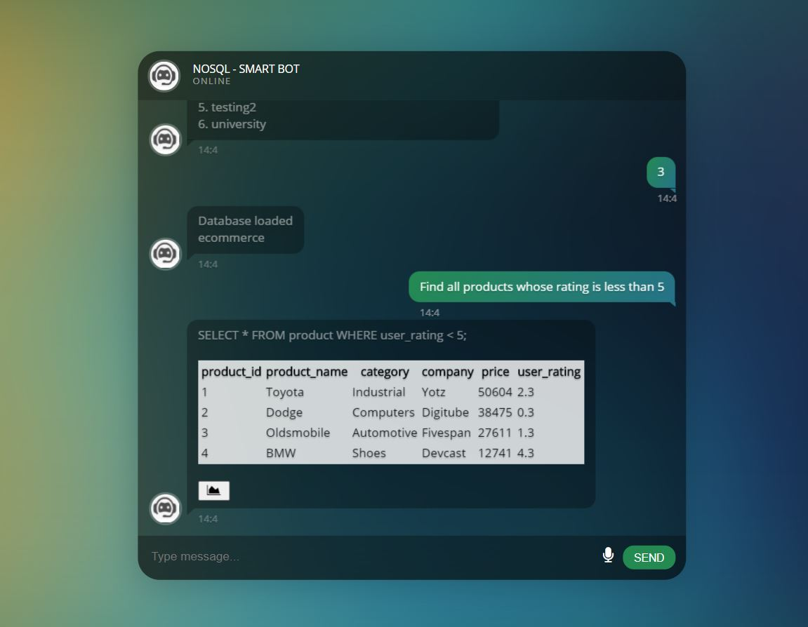

# Pasckathon_Hack-o-holics
noSQL - Not Obligatory SQL - a Natural Language Interface for SQL based databases

Personal Assistance interface applicable for most of the web and application interfaces which allows a user with no previous knowledge about SQL to retrieve data from Relational Databases using Natural language processing.

We investigate avenues of using natural english utterances - sentence or sentence
fragments - to extract data from an SQL, a narrower inspection of the broader natural language to machine language problem. We intend to contribute to the goal of a robust natural language to data retrieval system.

Implemented a Natural Language interface to access a Relational Database Management System for users who do not have knowledge about SQL. The user can access the database using a chatbot interface where he/she can retrieve data using simple English language rather than using complex SQL queries. 

The system takes .sql file as an input and an SQL parser program fetches the tables, attributes, primary keys of each table and the relations between the tables(foreign keys).

### Features
> 1. First of a kind chatbot interface which can be integrated with any database system.
> 2. Access Database from an interactive interface.
> 3. Give suggestions when user gives input.
> 4. Give accurate results in spite of grammatical and semantic errors using Deep Learning algorithms.
> 5. Speech-to-text and text-to-speech conversion

### Tech Stack

###### Backend
> 1. Django
> 2. Spacy
> 3. NLTK
> 4. Python
> 5. MySQL
> 6. Word2VEc

###### Frontend
> 1. HTML5
> 2. CSS3
> 3. Bootstrap4
> 4. AJAX
> 5. JQuery

### Installation and Execution
To install virtual environment and django

    $ python3 -m pip install virtualenvwrapper-win
    $ python3 -m pip install django
    
To install nltk  
  
    $ python3 -m pip install nltk
   
To install SpeechRecognition module

    $ python3 -m pip install SpeechRecognition
    
To install mysql-connector

    $ python3 -m pip install mysql-connector
    

To run the application, go to the folder with the files and open the command prompt directed to the current directory. Then give the following commands - 

    $ pip install virtualwrapper-win
    $ mkvirtualenv environment_name
    $ workon environment_name
    $ pip install django
    $ python manage.py runserver

For Output - Go to http://127.0.0.1:8000/ to open the page

### Implementation snippets 

### Application
This kind of interface has wide applications where the users of the database don’t necessarily need to be well-versed with SQL language. Such systems can be used in -
> * Hospitals to store and retrieve medical records 
> * Financial markets to analyse market trends and 
> * E-commerce companies to save and retrieve data of customers and products

### Future Work
> 1. Complex queries like JOINs and sub-queries.
> 2. Multilingual facility.
> 3. Increased efficiency for complicated English questions.
> 4. Download option for large output data.

### Contributors
> * Heeral Dedhia <heeral.d@somaiya.edu>
> * Dev Chaurasia <dev.c@somaiya.edu>
> * Krunal Dabhi <krunal.dabhi@somaiya.edu>
> * Sagar Dama <sagar.ud@somaiya.edu>
> * Harsh Gokhru <harsh.gokhru@somaiya.edu>
> * Meet Bhanshali <meet.rb@somaiya.edu>

